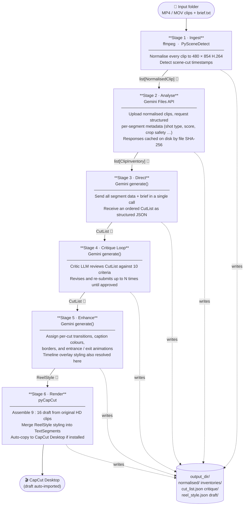
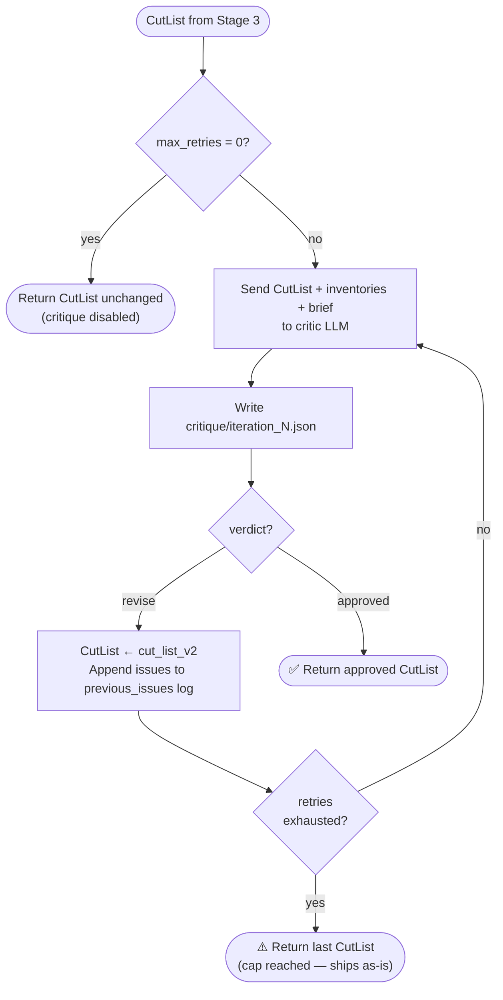
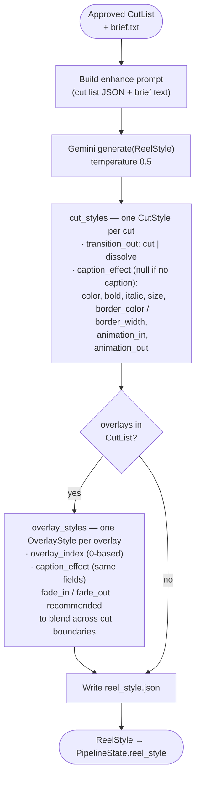
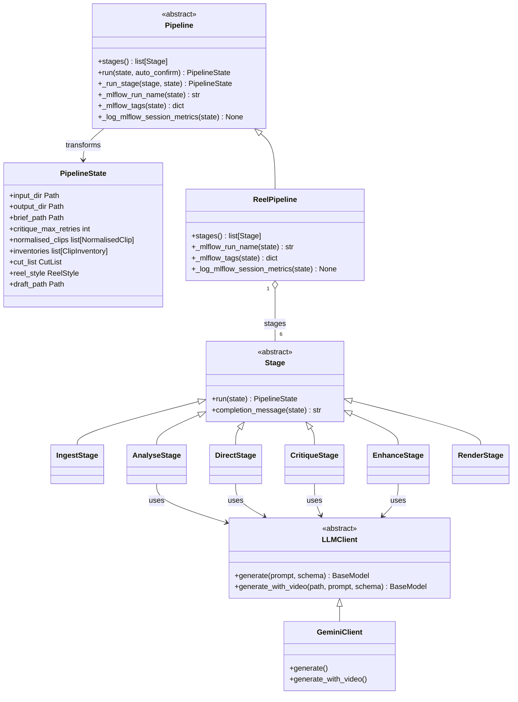

# Architecture

Five diagrams covering the pipeline end-to-end, the critique loop, the enhance stage, the render stage, and the extensibility model.

---

## 1 · Pipeline overview

Each stage transforms the shared `PipelineState` and writes its output to disk before pausing for a human confirmation prompt (skippable with `--yes`).

> **👤** = human confirmation prompt between stages. All prompts are skipped when `--yes` is passed.

---

## 2 · Stage 4 — Critique loop

The critic LLM checks ten criteria (duration, cut count, hook-first, shot variety, crop safety, aesthetics, story arc, brief alignment, caption timing bounds, overlay timing bounds). If any fail, it returns a corrected `cut_list_v2` and the loop repeats. The loop ships the last cut list once the retry cap is hit.

---

## 3 · Stage 5 — Enhance

A single LLM call focused purely on visual styling — no footage re-analysis. The approved `CutList` (including any `overlays`) and the brief are sent; the model returns a `ReelStyle` that decorates every cut and overlay with transition choices, text colour, border, size, and entrance/exit animations. The `CutList` itself is never modified.

---

## 4 · Stage 6 — Render & CapCut export

`run()` iterates over every `Cut` in order, assembling a `ScriptFile` timeline. For each cut it resolves transition and caption styling from `ReelStyle` (if present), falling back to the `CutList` values. After all cuts are placed, timeline `overlays` are rendered using absolute millisecond positions. After saving, it detects CapCut on the local machine and, if found, copies source clips into the draft folder and rewrites the absolute paths in `draft_info.json`.

```mermaid
flowchart TD
    START(["Approved CutList\n+ optional ReelStyle"])

    INIT["Create pyCapCut DraftFolder\nfolder + display name:\nLasagnaStack - {title} {YYYYMMDD_HHMMSS}"]

    MATERIAL["VideoMaterial\nprobe source clip with pymediainfo\n(original HD — not normalised)"]
    CROP["Compute ClipSettings\n9:16 portrait crop from landscape source\ncenter / left_third / right_third + offset_x nudge"]
    CLAMP["Clamp out-point to clip duration\n(guards against LLM over-shoot)"]
    SEGMENT["VideoSegment\n(source_timerange, speed, ClipSettings)"]

    TRANS{"ReelStyle transition_out\nor cut.transition_out =\nfade / dissolve?"}
    ADD_TRANS["Add 叠化 cross-dissolve\nto preceding segment"]

    CAP{"Cut.caption set?"}
    STYLE["Resolve CaptionEffect from ReelStyle\n(color → RGB, bold, italic, size,\nborder, animation_in / animation_out)"]
    ADD_CAP["TextSegment on captions track\ntransform_y positions top / center / bottom\nTextBorder and add_animation() applied"]

    MORE{"more cuts?"}

    OVERLAYS{"CutList.overlays\nnon-empty?"}
    ADD_OV["For each overlay:\nTextSegment at absolute timeline position\n(start_ms / end_ms → microseconds)\nend clamped to total reel duration\nOverlayStyle applied if present in ReelStyle"]

    SAVE["script.save() → draft_info.json\n_patch_platform() fixes OS fields"]

    DETECT{"CapCut found at\n~/Movies/CapCut/User Data/?"}

    EXPORT["Copy all input .mp4/.mov into draft folder\nRewrite 'path' fields in draft_info.json\nUpdate draft_meta_info.json (materials list)\nRegister draft in root_meta_info.json"]

    CC(["🎬 CapCut Desktop\n(draft + media self-contained)"])
    LOCAL(["📁 output_dir/draft/\n(manual import needed)"])

    START --> INIT --> MATERIAL --> CROP --> CLAMP --> SEGMENT --> TRANS
    TRANS -->|yes| ADD_TRANS --> CAP
    TRANS -->|no| CAP
    CAP -->|yes| STYLE --> ADD_CAP --> MORE
    CAP -->|no| MORE
    MORE -->|yes| MATERIAL
    MORE -->|no| OVERLAYS
    OVERLAYS -->|yes| ADD_OV --> SAVE
    OVERLAYS -->|no| SAVE
    SAVE --> DETECT
    DETECT -->|yes| EXPORT --> CC
    DETECT -->|no| LOCAL
```

---

## 5 · Extensibility model

`Stage` and `Pipeline` are abstract base classes. `PipelineState` is an immutable dataclass — each stage receives it and returns a new copy with its field populated. `LLMClient` is a provider-agnostic interface; swap it by subclassing and injecting an instance.

> To **add a stage**: subclass `Stage`, implement `run()` and `completion_message()`, then insert an instance into `ReelPipeline.stages`.
> To **swap the LLM provider**: subclass `LLMClient` and pass an instance to `ReelPipeline(client=…)`.
> To **create a new pipeline**: subclass `Pipeline`, declare `stages`, and optionally override `_mlflow_run_name`, `_mlflow_tags`, and `_log_mlflow_session_metrics` — MLflow tracking (run, per-stage CHAIN spans, and post-run metrics) is inherited automatically.
