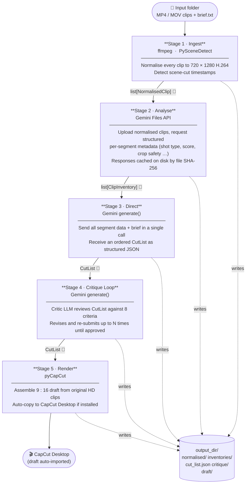
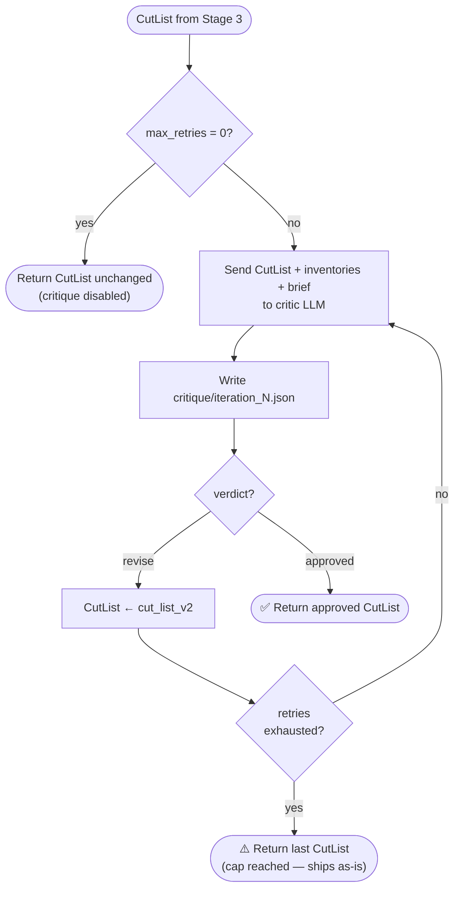
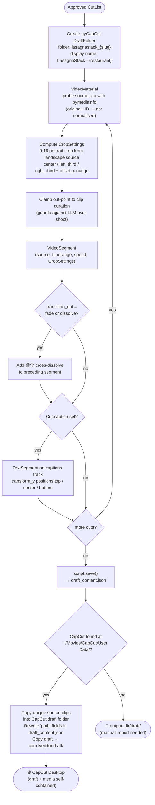
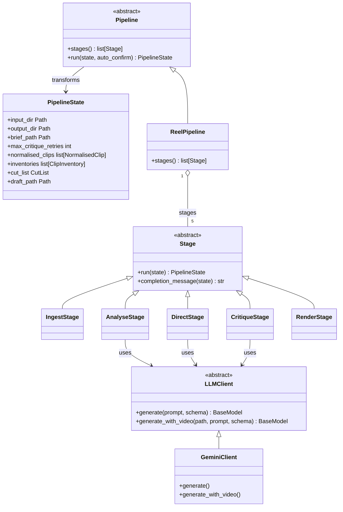

# Architecture

Four diagrams covering the pipeline end-to-end, the critique loop, the render stage, and the extensibility model.

---

## 1 · Pipeline overview

Each stage transforms the shared `PipelineState` and writes its output to disk before pausing for a human confirmation prompt (skippable with `--yes`).

> **👤** = human confirmation prompt between stages. All prompts are skipped when `--yes` is passed.

---

## 2 · Stage 4 — Critique loop

The critic LLM checks eight criteria (duration, cut count, hook-first, shot variety, crop safety, aesthetics, story arc, brief alignment). If any fail, it returns a corrected `cut_list_v2` and the loop repeats. The loop ships the last cut list once the retry cap is hit.

---

## 3 · Stage 5 — Render & CapCut export

`run()` iterates over every `Cut` in order, assembling a `ScriptFile` timeline. After saving, it detects CapCut on the local machine and, if found, copies source clips into the draft folder (so CapCut finds all media without re-linking) and rewrites the absolute paths in `draft_content.json`.

---

## 4 · Extensibility model

`Stage` and `Pipeline` are abstract base classes. `PipelineState` is an immutable dataclass — each stage receives it and returns a new copy with its field populated. `LLMClient` is a provider-agnostic interface; swap it by subclassing and injecting an instance.

> To **add a stage**: subclass `Stage`, implement `run()` and `completion_message()`, then insert an instance into `ReelPipeline.stages`.
> To **swap the LLM provider**: subclass `LLMClient` and pass an instance to `ReelPipeline(client=…)`.
